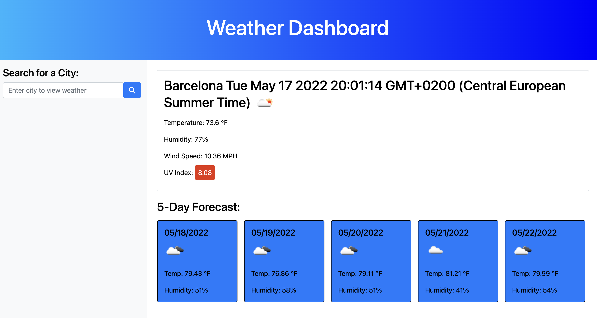
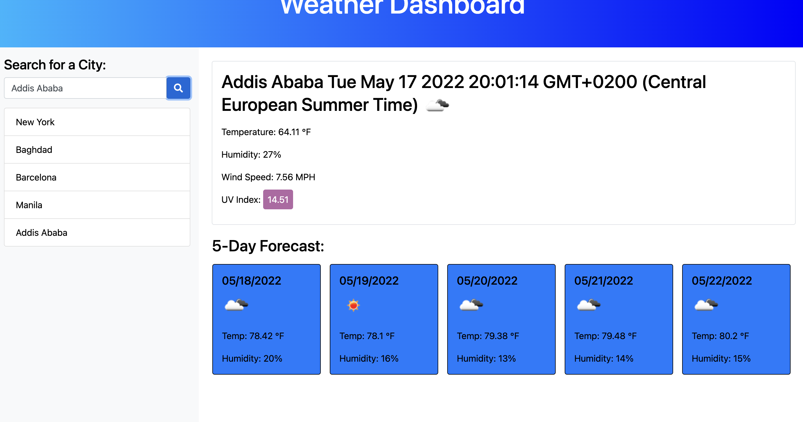

<h1 align="center">Weather Dashboard<h1>

## The purpose of this project was to allow users to see the weather forecast for different cities so can plan for their travels. Using [OpenWeather API](https://openweathermap.org/api) to retrieve weather data for the cities searched.  The cities searched are then saved in `localStorage` up to five cities.

## User Story

```
AS A traveler
I WANT to see the weather outlook for multiple cities
SO THAT I can plan a trip accordingly
```

## Acceptance Criteria

```
GIVEN a weather dashboard with form inputs
WHEN I search for a city
THEN I am presented with current and future conditions for that city and that city is added to the search history
WHEN I view current weather conditions for that city
THEN I am presented with the city name, the date, an icon representation of weather conditions, the temperature, the humidity, the wind speed, and the UV index
WHEN I view the UV index
THEN I am presented with a color that indicates whether the conditions are favorable, moderate, or severe
WHEN I view future weather conditions for that city
THEN I am presented with a 5-day forecast that displays the date, an icon representation of weather conditions, the temperature, and the humidity
WHEN I click on a city in the search history
THEN I am again presented with current and future conditions for that city
```

##Deployed Application: https://goodwinamundson.github.io/weather-dashboard/






